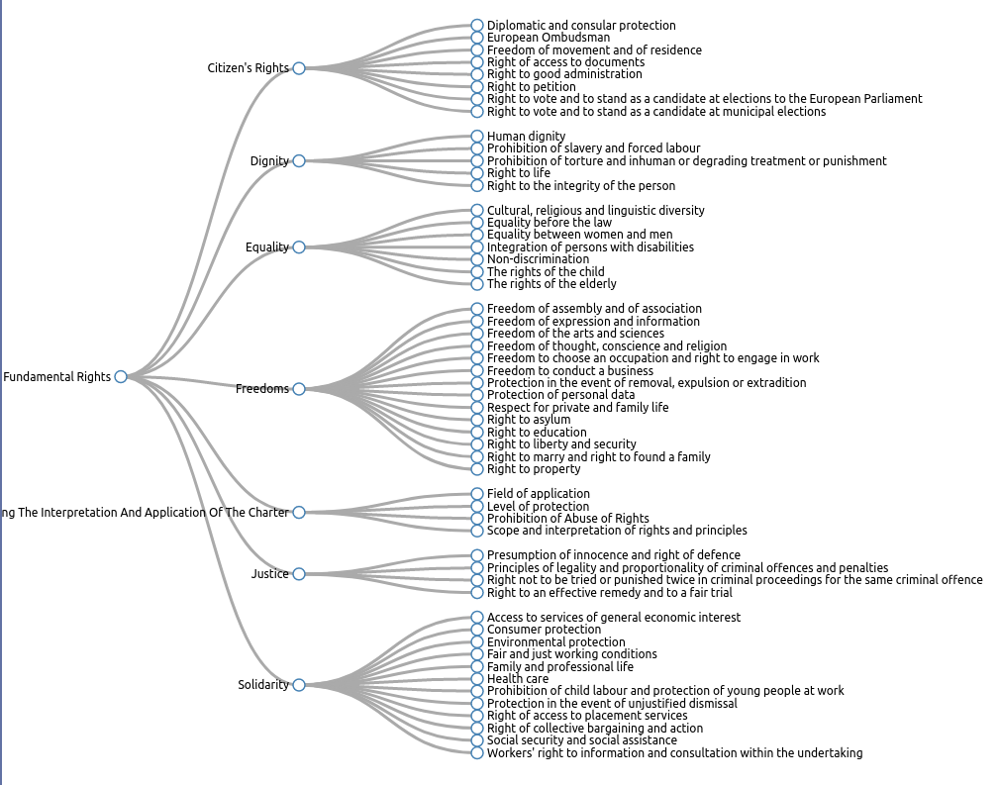

# fundamental-rights
A Thesauri of Fundamental Rights defined in the EU Charter

## Summary

This is an ongoing effort to provide *Rights* as provided for in EU law in the form of semantic concepts that can be referenced and used as data, for example to express impacts in risk assessment, or to identify what rights are applicable.

For now, it only provides a thesauri of rights from [EU Charter of Fundamental Rights](http://data.europa.eu/eli/treaty/char_2012/oj), based on modelling each article's title as an independent concept, and structuring them all together within a SKOS hierarchical taxonomy.

*   Thesauri of Fundamental Rights
    *   Citizen's Rights
        *   Diplomatic and consular protection
        *   European Ombudsman
        *   Freedom of movement and of residence
        *   Right of access to documents
        *   Right to good administration
        *   Right to petition
        *   Right to vote and to stand as a candidate at elections to the European Parliament
        *   Right to vote and to stand as a candidate at municipal elections
    *   Dignity
        *   Human dignity
        *   Prohibition of slavery and forced labour
        *   Prohibition of torture and inhuman or degrading treatment or punishment
        *   Right to life
        *   Right to the integrity of the person
    *   Equality
        *   Cultural, religious and linguistic diversity
        *   Equality before the law
        *   Equality between women and men
        *   Integration of persons with disabilities
        *   Non-discrimination
        *   The rights of the child
        *   The rights of the elderly
    *   Freedoms
        *   Freedom of assembly and of association
        *   Freedom of expression and information
        *   Freedom of the arts and sciences
        *   Freedom of thought, conscience and religion
        *   Freedom to choose an occupation and right to engage in work
        *   Freedom to conduct a business
        *   Protection in the event of removal, expulsion or extradition
        *   Protection of personal data
        *   Respect for private and family life
        *   Right to asylum
        *   Right to education
        *   Right to liberty and security
        *   Right to marry and right to found a family
        *   Right to property
    *   General Provisions Governing The Interpretation And Application Of The Charter
        *   Field of application
        *   Level of protection
        *   Prohibition of Abuse of Rights
        *   Scope and interpretation of rights and principles
    *   Justice
        *   Presumption of innocence and right of defence
        *   Principles of legality and proportionality of criminal offences and penalties
        *   Right not to be tried or punished twice in criminal proceedings for the same criminal offence
        *   Right to an effective remedy and to a fair trial
    *   Solidarity
        *   Access to services of general economic interest
        *   Consumer protection
        *   Environmental protection
        *   Fair and just working conditions
        *   Family and professional life
        *   Health care
        *   Prohibition of child labour and protection of young people at work
        *   Protection in the event of unjustified dismissal
        *   Right of access to placement services
        *   Right of collective bargaining and action
        *   Social security and social assistance
        *   Workers' right to information and consultation within the undertaking
        
## Future Plans

1. To provide a more thorough representation of concepts by breaking down existing ones into more granular forms, and including specific concepts from sub-clauses within the charter
2. Providing relationships between concepts where possible, i.e. ontological modelling
3. Collecting rights from other laws so as to provide a thesauri of all rights
4. Enabling rights discovery and application relevance - see section below
5. Provide ELI modelling or Akoma Ntoso modelling of concepts where the defining clauses are provided as linked data e.g. indicate a specific concept comes from Art.X-y-z of Law A of Location B
6. Aligning or involving mapping to UN documents and concepts for a more *universal* take on rights

## Enabling Rights Discovery

The hypothesis is that expressing a graph of rights as "concepts" with a "scope" and an use-case with the same concepts enables finding relevant rights by traversing paths that go from use-case to rights. For this, each right needs to be expressed as an ontological model with relevant concepts and a clear indication of what determines the scope of that right or affects involvement of that right.

For example, for Article 8 Protection of personal data in EU Charter of Fundamental Rights, the concepts relate to processing of personal data, its purpose, legal basis, and specific additional rights applied to collected data. To discover what rights are applicable, the relation *scope* is useful - so any context where processing of personal data takes place or has collected data will involve these 3 rights.

